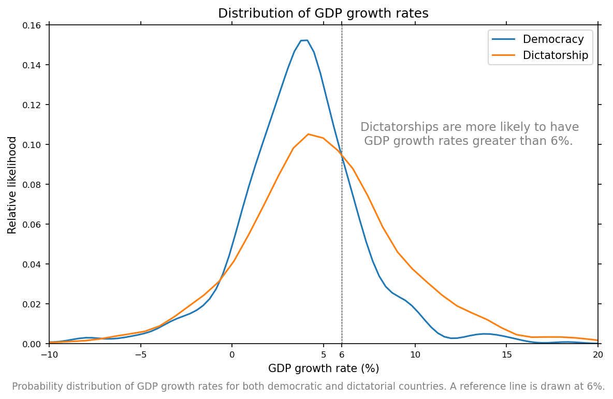
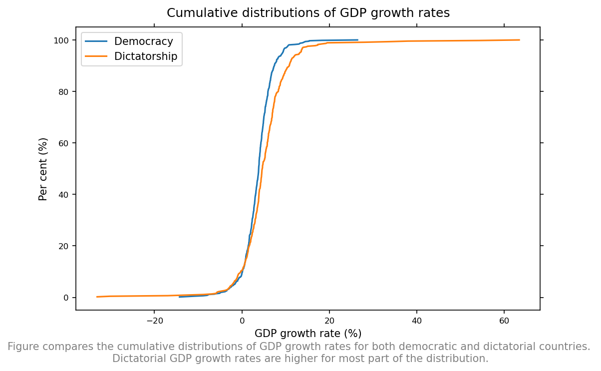
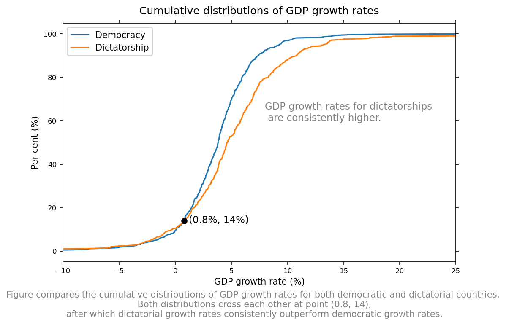
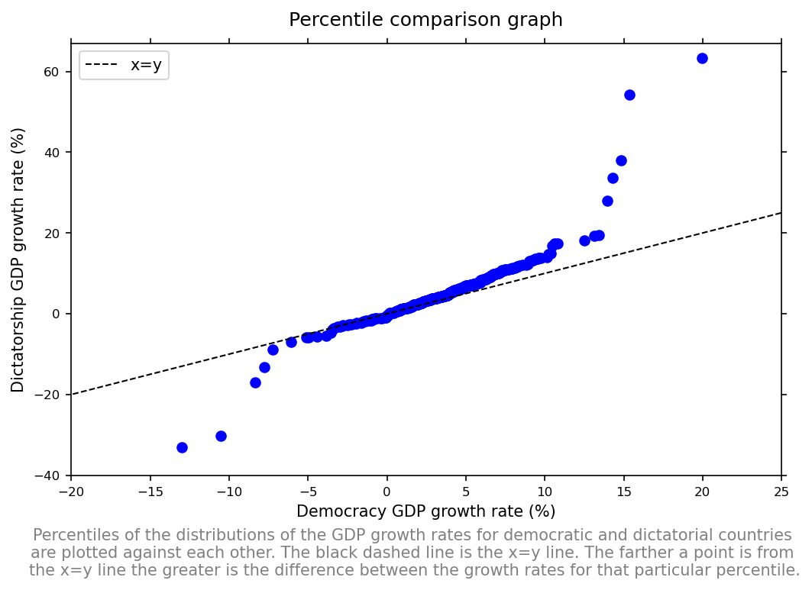
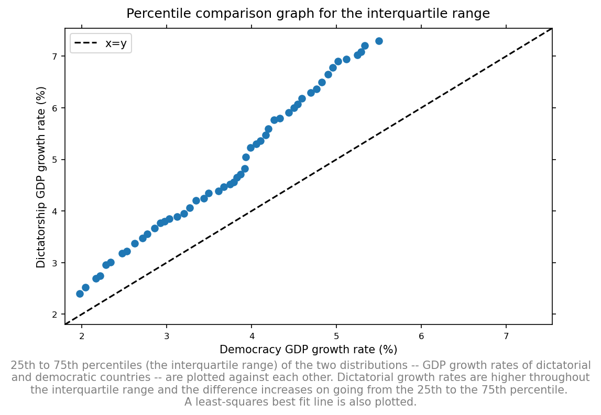
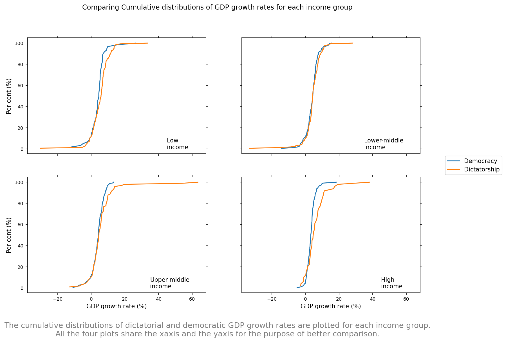
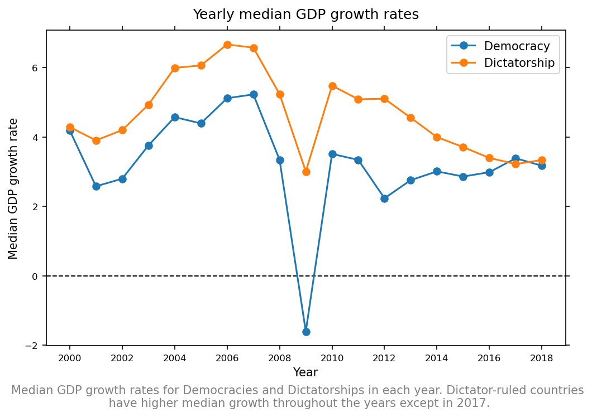

# Are dictatorships economically more successful than democracies?
## They are more likely to grow faster.

We all have had those debates about democracy vs dictatorship. Dictatorship advocates argue that dictator-ruled countries grow faster economically and their argument is bolstered by the examples of China and the Asian Tigers. 
Do dictator-ruled countries outperform democratic countries in economic growth?

The following figure shows the distribution of the GDP growth rates for both dictatorial and democratic countries.

Dictatorship countries are more likely to have growth rates greater than 6%. According to the GDP growth rate data (for years 2000 - 2005) from the world bank, 38% of the growth rates corresponding to dictatorial countries are greater than 6%, compared to 20% for democratic countries.

Dictator-ruled countries have 0.82% higher growth rate, on average, compared to democratic countries. But the average does not tell the whole story.

The following figure compares the cumulative distribution of the GDP growth rates for both types.

Dictatorship has higher values of GDP growth for most of the distribution. Dictatorial growth rates also have a much wider range as is evident from the tails of the distribution.

A closer look at the same graph follows.

Both the cumulative distributions cross each other, approximately, at the point (0.8, 14). This means that 14% of the GDP growth rates for both the types -- democracies and dictatorships -- are equal to or less than 0.8%.
After crossing each other at this point, dictatorial growth rates consistently outperform democratic growth rates.

How to interpret this information?

Let us say a global investor has the option of investing in one of two countries. One of the countries is a democracy and the other is a dictatorship. He wants to invest in a country with a GDP growth rate of at least 3%. The GDP growth rates for the two countries is unknown, so he will have to make a bet, but an informed one. From the graph above, the threshold of 3% (set by the investor) is way higher than 0.8% (the 14th percentile), so he can show more confidence in the dictator-ruled country. The higher the threshold, the more confident he can be in choosing the dictator-ruled country.

But if the strategy is to minimize loss rather than to maximize profit, the investor might want to invest in the democratic country. 
Look at the Percentile comparison graph or Q-Q plot, below.

On the lower end -- below zero -- the points are under the x=y line, which means dictatorial growth rates are more negative than the democratic growth rates for the lower percentiles. 
But for the higher percentiles dictatorship has much higher growth rates, too.

The figure below is also a percentile comparison graph but the percentiles plotted are in the range 25 to 75 -- the interquartile range.

Dictatorship dominates throughout the interquartile range.

## Controlling for income
High-income countries tend to be democratic. And poorer countries tend to grow more rapidly than wealthier economies due to the catch-up effect. 
So I categorised the countries according to their income levels and did a similar analysis.

Below are the cumulative distributions of the GDP growth rates for all the groups.

In the lower-middle-income group, both the distributions, except for the tails, follow each other closely. 

Dictatorship outperforms democracy in the high-income group. The average difference between the means of the two types of governing systems in the high-income group is 1.47%. Also, dictatorship has lower negative values below zero when compared with democracy in the high-income group.

Below are the differences in the means of the groups.

INCOME GROUP | DIFFERENCE IN THE MEDIAN GDP GROWTH RATE
-------------|-----------------------------------------
Lower-income | 1.3%
Lower-middle-income | -0.06%
Upper-middle-income | 0.4%
High-income | 1.47%

The highest difference is in the high-income group, followed by lower-income, upper-middle-income, and lower-middle-income.

## Are the findings consistent?
Yes and no.
The above analysis is for the years 2000 to 2005. The same analysis has been done on data for the years 2006 to 2011 and 2012 to 2018.

Yes because dictatorship, on average, had higher GDP growth rates in the subsequent analysis.

No, because there are some discrepancies between the results shown above and in the subsequent analysis:
 - The difference in the average GDP growth rates for the two types of governing systems keeps fluctuating. For example, in the 2006 to 2011 dataset, the difference increased to 2.04%. In the 2012 to 2018 dataset, the difference came down to 0.96%.
 
  DATA SET | DIFFERENCE IN THE MEDIAN GDP GROWTH RATE (DICTATORSHIP - DEMOCRACY)
 ----------|--------------------------------------------------------------------
 For years 2000 - 2005 | 0.82%
 For years 2006 - 2011 | 2.04%
 For years 2012 - 2018 | 0.96%
 
 - In the 2012 to 2018 dataset, the pattern that we saw after the income classification breaks.

## Conclusion
Dictatorships are more likely to have higher GDP growth rates than democracies.

Below are the average GDP growth rates for both democratic and dictatorship countries from the year 2000 to 2018.

During the 2008-2009 financial crisis, the average GDP growth rate of dictatorship countries remained positive but the average GDP growth rate of democratic countries plunged into the negative territory.

## Limitation
GDP growth rates, in most cases, are reported to the world bank by the countries themselves. The accuracy of the growth rates depends on the criteria of the country measuring it. Therefore, growth rates are sometimes over or underestimated.

GDP growth rates do not give a complete picture of the health of the economy. Many other factors should be taken into consideration to get a complete picture.

Methodology
I have used the GDP growth rate data from the world bank. This data set has growth rates for years 1960 - 2019. I only used data after the year 2000.
The classification of countries into dictatorships and democracies was done using the dd index or the dd dataset. You can read about the classification criteria here.

I removed some observations with missing values of GDP growth rate. A total of 101 or 1% of the total observations were missing. Of the 101 missing observations, 75 belonged to dictatorship and 26 belonged to democracy.

I divided the dataset into three parts:
From the year 2000 to 2005
From the year 2006 to 2011
From the year 2012 to 2018
I analyzed the first data set and verified the results on the other two.

Median is the average, throughout the analysis.

## A request from the author
Dear reader,
Please help me improve. Your feedback and suggestions are highly valuable. You can email me your suggestion or feedback at armangill.bzp@gmail.com.
Thank you for reading.
